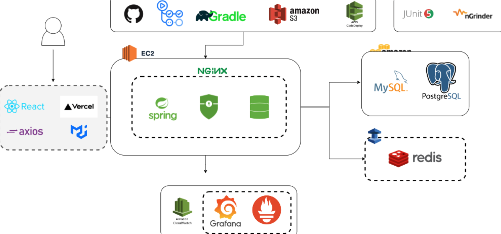
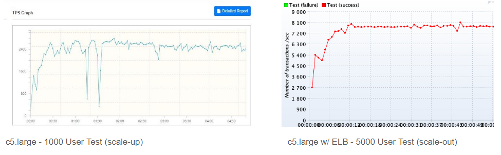

# 📈 STOCK'ER

### 대용량 데이터와 트랜잭션을 빠르고 안정적으로 처리, 피크 시간의 트래픽도 순조롭게 관리—당신의 주식 매매, 우리가 믿음직하게 지원합니다!👍


## 📚Team Jira 보러가기

[Jira 보러가기](https://dojunkim.atlassian.net/wiki/spaces/hanghaefin/overview?homepageId=131587)


## ✨Team Brochure 보러가기

<!-- // TODO : CHANGE LINK -->
[Brochure 보러가기](https://misty-composer-643.notion.site/NETicket-2b06067c2b2448faa71951f43f225a0a)
<br>


# 💁🏻‍♂️프로젝트 소개

// TODO: FIX CONTENT?

```jsx
🔍 안정성과 성능
대규모 트래픽 부하 테스트를 nGrinder로 수행하여, 시스템의 안정성을 최적화했습니다. 동시에 10K 요청을 평균 8000 TPS 처리량과 평균 응답 속도 약 2초 내외로 빠르고 안정적으로 처리합니다.

🔒 보안
Spring Security를 통해 사용자 인증과 권한 관리를 철저히 처리, 안전한 거래 환경을 제공합니다.

📊 모니터링과 분석
Grafana와 Prometheus를 활용하여 실시간 모니터링과 성능 분석을 실행, 그리고 AWS CloudWatch로 클라우드 서비스 모니터링을 통하여 시스템의 안정성과 성능을 지속적으로 유지합니다.

🚀 데이터 캐싱과 실시간 이벤트 처리
Redis의 Pub/Sub를 활용해 빠른 데이터 조회와 캐싱을 제공하며, 보다 빠르고 효율저긴 데이터 제공을 가능하게 합니다.

🗂️ DB 인덱싱 & DB Locking
데이터 조회의 효율성을 높이기 위한 DB 인덱싱을 적용하고, DB Locking 메커니즘으로 동시성 문제와 데이터 무결성을 확보, 거래와 정보 조회에서의 지연 시간과 오류 확률을 최소화합니다.

STOCK&apos;ER 은 고성능, 철저한 보안, 데이터의 효율성, 그리고 트랜잭션의 안정성을 동시에 제공합니다. 
"No Error, Just Secure, Efficient, and Ultra-Stable Trading!"
```


# 👨‍👨‍👧‍👦 Team

| 이름    | GITHUB                          |
| ------- | ------------------------------- |
| 김도준🔰 | https://github.com/downside154  |
| 이의진  | https://github.com/powerlife145 |
| 최현성  | https://github.com/ByHorizon    |
| 이선우  | https://github.com/tjsdn9803    |

---


# 💻주요기능

<details>
<summary>주요기능🧐</summary>
<div markdown="1">

### 📌 Redis Cache를 사용한 빠른 랭킹 조회

<!-- // TODO: 시연 이미지 / GIF 필요!  -->


자주 조회되는 DB 정보를 Redis에서 캐싱을 사용하여 기존 DB 에서 직접 조회하는 것 보다 빠르고 효율적으로 기능 제공.

- 

### 📌 Redis의 Pub/Sub을 이용한 매매 시스템 구현

<!-- // TODO: 시연 이미지 / GIF 필요! -->

- 

### 📌 DB 인덱싱으로 매매한 종목을 내 계좌 저장 및 조회

<!-- // TODO: 시연 이미지 / GIF 필요! -->

데이터베이스에서 검색되는 데이터를 인덱싱하여 빠른 조회가 가능하게 합니다.

- 

### 📌 Spring Security를 이용한 유저 시스템


[Spring Security Image](./resources/images/securityfilterchain.png)

Spring Security를 활용해서 서비스 이용자의 정보를 안전하게 처리하고 클라이언트 정보를 보호합니다.


- 

</div>
</details>

---

# 🎀프로젝트 챌린지 포인트


<details>
<summary>📈 사용자의 원활하고 끊김 없는 서비스 제공 위한 높은 TPS와 빠른 응답속도</summary>
<div markdown="1">

    저희 프로젝트의 주요 목표는 사용자가 항상 원활하고 끊김 없는 서비스를 이용할 수 있도록 하는 것입니다. 이를 위해, 대규모 트랜잭션 상황에서도 안정적이면서도 높은 TPS와 빠른 응답속도를 제공하기 위해 다양한 기술적 요소를 적절하게 활용하였습니다.
    
    우선, 분산 처리 아키텍처와 In-memory caching, Database Tuning 등의 기술을 조합하여 안정적이면서도 높은 TPS와 빠른 응답속도를 실현하였습니다. 
    특히, Redis Cache를 활용하여 In-memory Data Store를 구축하여 자주 조회되는 데이터 조회 응답속도를 크게 향상했습니다.
    
    또한, 트래픽 분산을 위한 Load Balancing과 어플리캐이션 클라우드 인스턴스를 확장 및 축소를 자동으로 처리하는 Auto Scaling을 도입하여, 트래픽 급증 시에도 끊김 없는 서비스를 제공할 수 있도록 구성하였습니다. 동시 접속한 1만 유저의 요청을 평균 8000 TPS 로 처리하고 평균 응답시간 2초 이하로 구현했습니다.
    
    마지막으로, HikariCP를 활용하여 Database 연결을 최적화하고, 서버 분산을 통해 데이터베이스 커넥션 병목 현상을 예방하여 안정적인 서비스를 구현하였습니다. 
    
    이러한 다양한 기술적 요소들을 적절하게 조합하여, 저희 서비스는 높은 성능과 안정성을 동시에 유지할 수 있게 되었습니다. 이를 통해 사용자들은 언제나 원활하고 끊김 없는 서비스를 경험할 수 있게 되었습니다.

</div>
</details>    

<details>
<summary>🕸 데이터의 정확성과 일관성을 보장해, 데이터 무결성 확보</summary>
<div markdown="1">

    저희는 Redis를 도입하여 높은 TPS와 빠른 응답 속도를 확보하였으나, 중복 데이터로 인한 데이터의 일관성과 정확성 문제가 생겼습니다. 이에 대응하여 데이터 무결성을 확보하기 위해 아래와 같은 캐시 전략을 수립하였습니다.
    
    먼저 쓰기 전략으로 Write Back 방식을 도입하여, 매매 정보 수정 시  캐시에만 변경사항이 기록되고, 주기적으로 또는 특정 조건이 충족될 때 Database에 동기화합니다. 이를 통해 빠른 응답 시간과 Database의 부하를 줄일 수 있습니다. 
    
    특히, Redis의 Single Thread 특성과 원자적 연산을 사용해 락을 사용하지 않고도 동시성 제어를 하여 데이터 무결성을 확보할 수 있었습니다.
        
    종합적으로 Redis를 통해 대규모 트랜잭션 상황에서의 동시성 제어를 하면서, 위의 캐시 전략으로 데이터의 정확성과 일관성을 보장해 데이터 무결성을 확보할 수 있었습니다.

</div>
</details>    


<details>
<summary>📊 APM을 활용해서 시스템의 성능과 안정성을 지속적으로 관리</summary>
<div markdown="1">

    대규모 트랜잭션 상황에서 동시성 제어를 수행하며, 프로젝트의 챌린지 포인트 중 하나로 APM을 활용한 모니터링을 도입하였습니다. 
    이를 통해 시스템의 성능과 안정성을 지속적으로 관리하고 개선할 수 있었습니다. 
    
    저희 팀은 Grafana와 AWS CloudWatch 같은 다양한 모니터링 도구를 사용하여 시스템의 전반적인 성능을 실시간으로 확인하였습니다. 
    Grafana와 CloudWatch를 통해 EC2, ElasticCache, ELB , RDS, Auto Scaling 등의 상태를 실시간으로 모니터링할 수 있었습니다. 
    
    이러한 모니터링 도구들의 활용을 통해 시스템 내 문제가 발생했을 때 빠르게 진단하고 수정 및 개선 작업을 수행할 수 있었습니다. 결과적으로 프로젝트는 안정성과 높은 성능을 보장하는 성공적인 구현이 이루어졌습니다.

</div>
</details>    

<details>
<summary>📉 비용을 최소화하면서도 높은 가용성과 성능을 유지하는 가성비 최적화 전략</summary>
<div markdown="1">
​   
    저희는 최소 비용으로도 높은 가용성과 성능을 유지하는 것을 목표로 하며, 이를 위해 다양한 기술적인 방법과 전략적인 설계를 채택하였습니다. 
    
    EC2는 t2.micro, t3.small, 그리고 최종으로는 c5.large 서버를 사용했습니다. 다양한 크기의 서버들을 사용하고 테스팅해본 결과 저희 어플리케이션에 맞는 크기를 찾은 다음 이후 서버 확장이 필요할 경우 비용이 더 발생하는 Scale Up 방식보다 Load Balancing을 이용해 Scale Out 방식의 수평적 확장으로 비용을 최소화 하였습니다.
    
    Auto Scaling을 설정해 오픈 시간 직전과 트랜잭션이 몰리는 상황에서만 서버 인스턴스 확장을 하고, 서버 부하가 없는 대부분의 시간에는 서버 인스턴스가 최소로 유지됩니다. 서버 수를 동적으로 조절하여 자원 사용량을 최적화하고 비용 절감 효과를 극대화할 수 있었습니다.
    
    이를 통해 높은 가용성과 성능을 유지하면서도 비용을 최소화하는 것뿐만 아니라, 가성비 측면에서도 최적의 결과를 얻을 수 있도록 했습니다.

</div>
</details>    

---

# 📚 기술 스택

## ⚙ Architecture 구성도




## ⚔ 프로젝트에서 사용한 기술

### *💻 Backend*

---

📚 **Tech Stack**


       


🔩 **DB**

  


🗜 **Cloud**

      

💻 **Deployment**
     


⚖ **Test**

         


🖥 **Monitoring**

    


---

## 🏹 기술적 의사 결정

[기술적 의사 결정 과정 보러가기](https://dojunkim.atlassian.net/wiki/spaces/hanghaefin/pages/4685849/MVP)

## 🗺 API 명세서

[API 명세서 보러가기](https://dojunkim.atlassian.net/wiki/spaces/hanghaefin/pages/360573/API)

## 💾 ERD


---


# 👾 Trouble Shooting

### 🌟 매매 서비스 로직에서 데이터 무결성을 지키며 응답속도와 TPS 개선 🌟


<aside>
💡 챌린지 포인트로 설정한 목표를 달성하기 위해<br>
매매 서비스 로직에서 완성된 거래 데이터 무결성을 지켜야 하고,<br>
많은 트랜잭션을 처리하여 클라이언트에게 빠른 응답 속도로 매매 결과를 돌려줘야 합니다.
</aside>

<br><br>

<!--  TODO : 작성된 글 생기면 링크 연결  -->

1. 트랜잭션 충돌 문제를 비관적 락으로 해결
2. 비관적 락 적용 시 속도 문제를 Redis Cache로 해결
3. 트래픽 과부화를 ELB랑 AutoScaling 으로 해결
4. APM으로 찾은 병목현상을 Hikari, MySQL 튜닝으로 해결

<br>


### 🌟 조회 서비스 로직에서 Redis cache 응답속도와 TPS 개선  🌟

상위 랭킹 조회 등 DataBase를 조회하는 API의 응답속도가 느린 현상발견 

인덱싱을 활용하여 시간단축을 많이 시켰지만 아직 2초대로 느리다고 판단

어제자 거래기록의 데이터이므로 변동성이 없고 메인페이지에서 보여줄 데이터이기 때문에 캐싱을 이용하여 응답속도를 개선


### 🌟 서버 Scale-Up & Scale-Out을 통한 TPS 개선  🌟

클라우드 서버의 스펙(T2.micro)상 낮은 TPS발생


다양한 스펙들로 테스팅을 진행하여 프로젝트 어플리케이션에 맞는 기본 인스턴스 스펙(c5.large)으로 Scale-Up진행

Load-Balancer(AWS ELB)를 사용하여 Scale-Out진행



### 🌟 멀티 인스턴스 로드밸런싱 로직 개선  🌟

대상 그룹에 인스턴스를 추가하였음에도 불구하고 AWS로드 밸런서가 헬스체크를 실패하였다는 문구와 함께 접속이 불가능한 현상 발생


헬스체크 대상주소를 점검하고 로드밸런서 리스너 설정 확인후 최상위 도메인을 발급받아 ACM인증서로 https를 적용하여 해결 


### 🌟 레디스 직렬화 문제  🌟

Java에서 제공되는 기본적인 직렬화 인터페이스로 구현시도


구현 후 Redis에 저장된 데이터가 Java의 기본 직렬화 형식으로 저장되었는데 그것을 JSON형식으로 역직렬화 하려고 시도해서 발생하는 것으로 추정


Jackson기반의 Jackson2JsonRedisSerializer를 사용하여 해결

Jackson2JsonRedisSerializer : 제네릭 타입을 사용하므로 어떤 객체를 직렬화할지 역직렬화 할지 알 수 있습니다.

이 설정은 JSON 직렬화/역직렬화에 사용되고 ObjectMapper를 통해 추가적인 설정이 가능하게 됩니다.


---

# 🚀 성능 개선

<aside>

🛠 저희는 트러블 슈팅의 각 단계에서 성능이 어느 정도까지 개선되었는지 알아보기 위해,<br>
프로젝트 내내 ngrinder 랑 Apache Jmeter을 통해 부하테스트를 진행했습니다.<br>
평균 응답 속도(ms)와 처리량(TPS, Transacion Per Second)을 위주로 정리해 두었습니다.<br>


</aside>
<br>

[성능개선 항목 보러가기](https://dojunkim.atlassian.net/wiki/spaces/hanghaefin/pages/4423686)

---

